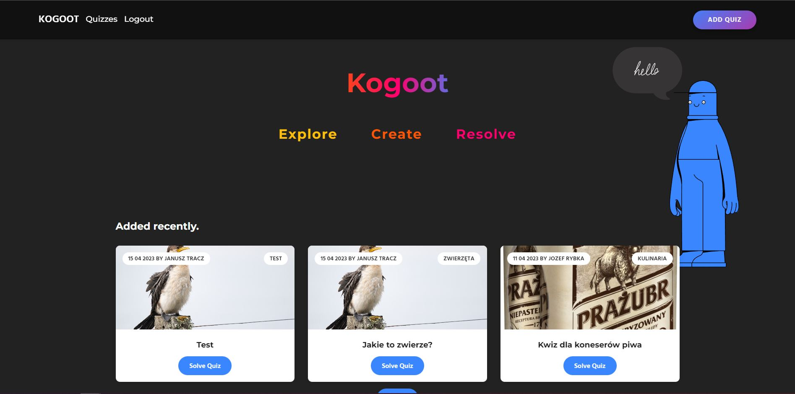
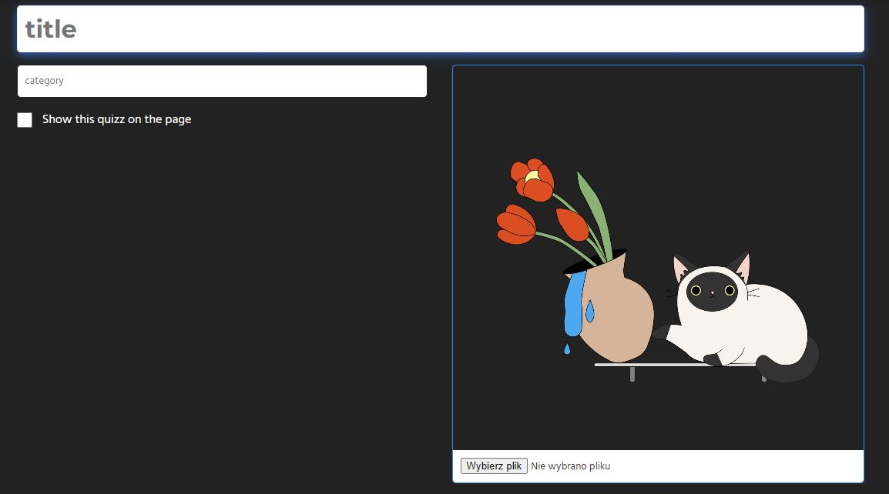
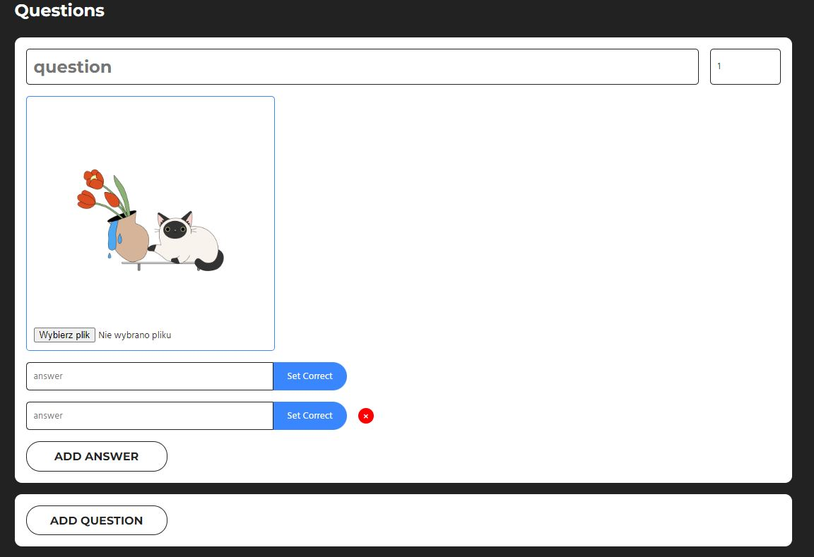

# What's new?
- Everything. All of these is new.

# About
Kahoot styled app create with PHP. 
The application allows you to create and solve simple quizzes based on a point system. Each question can have an unlimited number of answers. In the current version we propose to create only entertainment quizzes.

## Create project:

- unlimited questions and awswers

# Roadmap

- multiple choice questions
- meta user data
- quizzes meta data (recording and exporting answers)
- co-authors
- editing of existing projects

# Why use?
- open source
- between god and truth free is a fair price

- blazingly fast

# Q&A 
### What do you think is worth gold tickets?
- very nice animated button in header
- animated sections
- hosting 
- thumbnail previews 
### Why PHP?
I was told to use.
### What did this project teach you?
Life, laugh, love

## Are you evaluating this project for college?

That's great. Keep up good work or sth.
